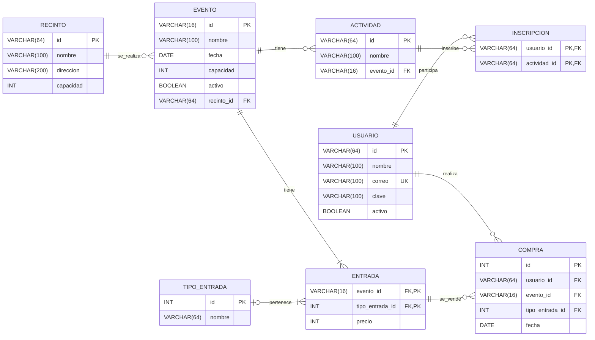

# MODELO ENTIDAD RELACION

```mermaid
erDiagram
    direction LR

    RECINTO ||--o{ EVENTO : "se_realiza"
    EVENTO 1 to zero or more ACTIVIDAD : "tiene"
    
    USUARIO 1 to zero or more COMPRA : "realiza"
    ENTRADA 1 to zero or more COMPRA : "se_vende"

    EVENTO 1 to one or more ENTRADA: "tiene"
    TIPO_ENTRADA zero or one to one or more ENTRADA: "pertenece"

    USUARIO 1 to zero or more INSCRIPCION: "participa"
    ACTIVIDAD 1 to zero or more INSCRIPCION: "inscribe"

    USUARIO {
        VARCHAR(64) id PK
        VARCHAR(100) nombre
        VARCHAR(100) correo UK
        VARCHAR(100) clave
        BOOLEAN activo
    }

    RECINTO {
        VARCHAR(64) id PK
        VARCHAR(100) nombre
        VARCHAR(200) direccion
        INT capacidad
    }

    EVENTO {
        VARCHAR(16) id PK
        VARCHAR(100) nombre
        DATE fecha
        INT capacidad
        BOOLEAN activo
        VARCHAR(64) recinto_id FK
    }

    ACTIVIDAD {
        VARCHAR(64) id PK
        VARCHAR(100) nombre
        VARCHAR(16) evento_id FK
    }

    COMPRA {
        INT id PK
        VARCHAR(64) usuario_id FK
        VARCHAR(16) evento_id FK
        INT tipo_entrada_id FK
        DATE fecha
    }

    ENTRADA {
        VARCHAR(16) evento_id FK, PK
        INT tipo_entrada_id FK, PK
        INT precio
    }

    TIPO_ENTRADA {
        INT id PK
        VARCHAR(64) nombre
    }

    INSCRIPCION {
        VARCHAR(64) usuario_id PK, FK
        VARCHAR(64) actividad_id PK, FK
    }
```